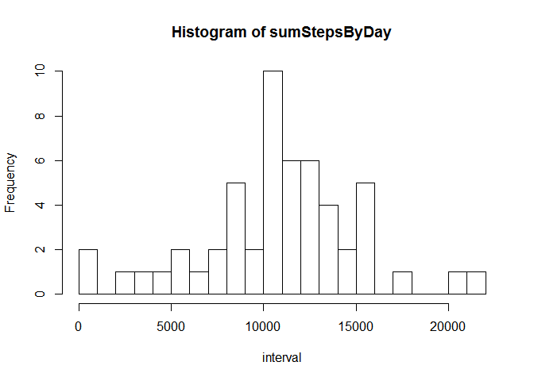
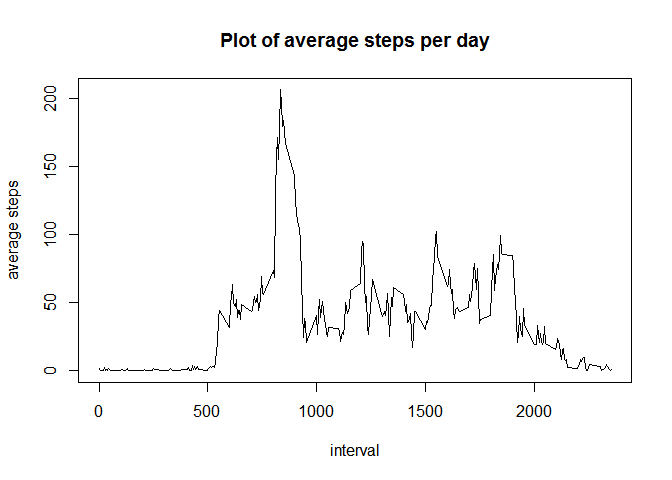
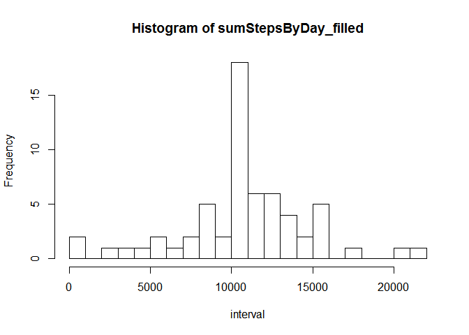
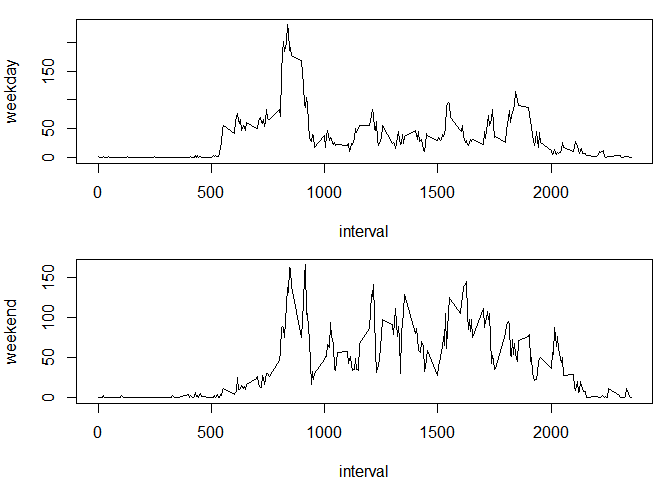

# Reproducible Research Project 1

## Introduction
This project makes use of data from a personal activity monitoring device. This device collects data at 5 minute intervals through out the day. The data consists of two months of data from an anonymous individual collected during the months of October and November, 2012 and include the number of steps taken in 5 minute intervals each day.

## Part 1
### load the data
Place the ".zip"" file in the same directory as this script and run the following code:

```r
file <- unzip("repdata_data_activity.zip")
data <- read.csv(file)
```

## Part 2
### total number of steps each day
Now we can extract the total No. of steps taken each day over the testing period from the data.The code below first splits data by date, plots the histogram of the total No. of steps per day, and then gives the statistical summary of it.

```r
stepsByDay <- split(data$steps,data$date)
sumStepsByDay <- sapply(stepsByDay, Reduce,f="+")
summary(sumStepsByDay) # ["Mean"],["Median"]
```

```
##    Min. 1st Qu.  Median    Mean 3rd Qu.    Max.    NA's 
##      41    8841   10760   10770   13290   21190       8
```

```r
par(mfrow=c(1,1))
hist(sumStepsByDay, breaks=24,xlab="interval")
```

 

## Part 3
### averaged number of steps per day
Now we can extract distribution of the number of steps in a day (as a function of intervals) averaged over the testing period. The following code first splits the data by the intervals in each day, average them over all testing days, plots results vs intervals.

```r
interval_factor <- as.factor(data$interval)
meanStepsByInterval <- sapply(split(data$steps, interval_factor),function(x) mean(unlist(x),na.rm=TRUE))
plot(unique(data$interval),meanStepsByInterval,type='l',xlab="interval",ylab="average steps",main="Plot of average steps per day")
```

 

```r
maxStepTime <- names(which.max(meanStepsByInterval))
```
From the above we can know that the maximum number of steps are taken in 835, which is 8:35.

## Part 4
### missing values
Now we start to deal with the missing values in the data set. the following code first finds the number of rows that contain missing data (NA), create a copy of the original data, and fill in those rows with the averaged values over all the measurements acquired in the corresponding interval. Summary of the new total number of steps in each day and its histogram are given as the output.

```r
missingInds <- which(is.na(data$steps))
missingRows <- length(missingInds)
filledData <- data
filledData$steps[missingInds] <- meanStepsByInterval[ as.character(data$interval[missingInds]) ]
stepsByDay_filled <- split(filledData$steps,filledData$date)
sumStepsByDay_filled <- sapply(stepsByDay_filled, Reduce,f="+")
summary(sumStepsByDay_filled) # ["Mean"],["Median"]
```

```
##    Min. 1st Qu.  Median    Mean 3rd Qu.    Max. 
##      41    9819   10770   10770   12810   21190
```

```r
hist(sumStepsByDay_filled, breaks=24,xlab="interval")
```

 

It is easily seen that by filling in the missing values, the overall histogram is not affected much, but the mean and median values of the total number of steps becomes slightly larger.


## Part 5
### weekday vs weekend activity pattern
Here we are trying to analyze the activity pattern between weekdays and weekends. The following code first categorizes the data measured from Mondays to Fridays as "weekday" data and that on Saturdays and Sundays as "weekend" data, averages the steps taken in each interval over all weekdays and weekends respectively, and then plot the distribution of mean number of steps taken in a day for both weekday and weekend.

```r
dates <- as.Date(filledData$date)
dates_factor <- mapvalues(weekdays(dates),from = c("Monday","Tuesday","Wednesday", "Thursday","Friday","Saturday","Sunday")
          ,to=c(rep("weekday",5),rep("weekend",2)))
dates_factor <- as.factor(dates_factor)
filledData$weektime <- dates_factor
dataByWeektime <- split(filledData,filledData$weektime)
dataWeekday <- dataByWeektime[[1]]
stepsWeekday <- sapply(split(dataWeekday$steps,dataWeekday$interval), function(x) mean(unlist(x)))
dataWeekend <- dataByWeektime[[2]]
stepsWeekend <- sapply(split(dataWeekend$steps,dataWeekend$interval), function(x) mean(unlist(x)))
par(mfrow=c(2,1),mar=c(4,4,1,1))
plot(unique(data$interval),stepsWeekday,type='l',xlab="interval",ylab="weekday")
plot(unique(data$interval),stepsWeekend,type='l',xlab="interval",ylab="weekend")
```

 

From the above we can see that on weekends more activities are observed after 10:00am, while it is basically the same before 10:00am on weekdays and weekends.

##End


